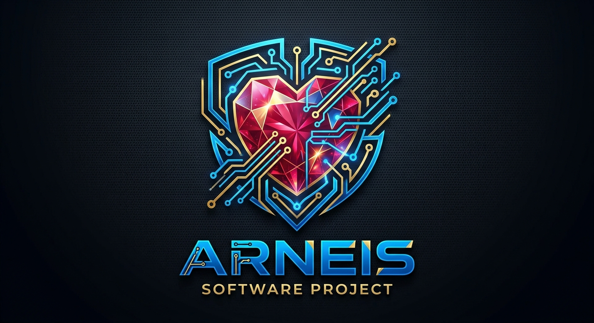

# 🍷 Arneis (Media Harness)



Arneis is a "kubectl-like" orchestration tool for complex media creation. It leverages Google's state-of-the-art AI models (Gemini, Lyria, Nanobanana, Veo, Chirp) to transform high-level Templates and YAML Specifications into rich, multi-part media artifacts.

## Features

- **Template-Driven:** Build Videos, Kids Stories, and Comic Strips using pre-defined classes.
- **Async Orchestration:** Parallel execution of generation tasks with Ruby Fibers.
- **Visual Feedback:** Emoji-rich progress tracking and Mermaid.js dependency graphs.
- **Technical Transparency:** Detailed resource tracking (tokens, cost) and artifact validation.

## Documentation

For a deeper dive into how Arneis works, check out the [User Manual](docs/user_manual.md).

## Usage

```bash
# Verify your environment and models
just test-all-models

# Research a project and generate a pitch YAML
just arnectl research-pitch data/samples/rubycon_research.md

# Apply a media plan
just arnectl apply data/samples/rubycon_sales_pitch.yaml

# Check status
just arnectl status out/latest_folder

# Verify generated artifacts
just arnectl verify out/latest_folder

# Generate a dependency graph (Mermaid.js)
just arnectl graph data/samples/rubycon_sales_pitch.yaml
```
