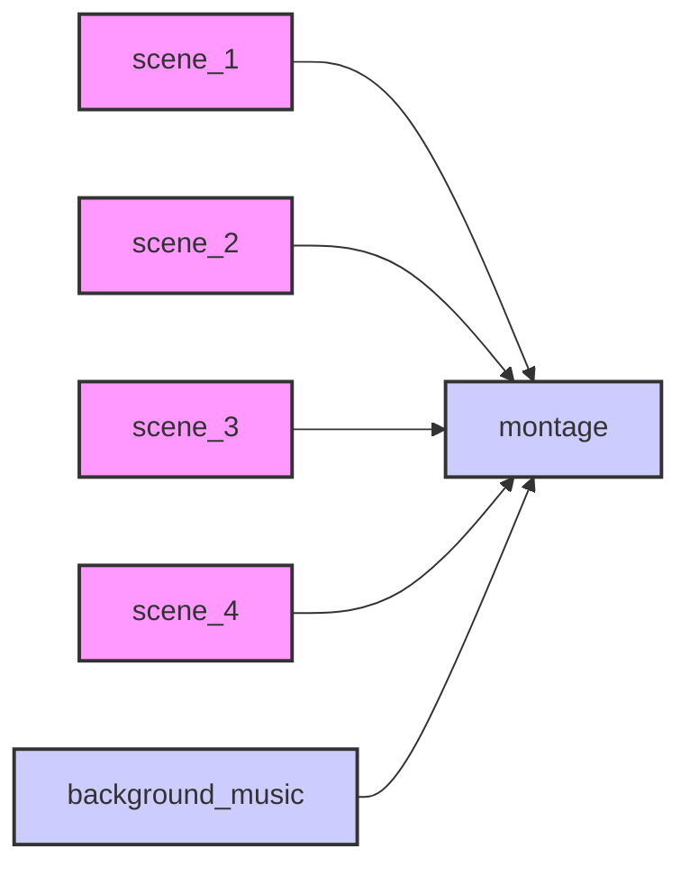

# Dependency Graph: Rubycon 2026: Code, Community, and the Italian Coast

```mermaid
graph LR
  classDef scene fill:#f9f,stroke:#333,stroke-width:2px;
  classDef project fill:#ccf,stroke:#333,stroke-width:2px;
  scene_1["scene_1"]:::scene
  scene_2["scene_2"]:::scene
  scene_3["scene_3"]:::scene
  scene_4["scene_4"]:::scene
  background_music["background_music"]:::project
  montage["montage"]:::project
  scene_1 --> montage
  scene_2 --> montage
  scene_3 --> montage
  scene_4 --> montage
  background_music --> montage
```