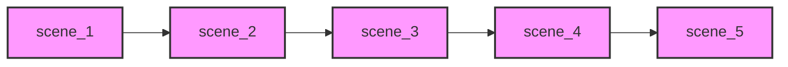

# Dependency Graph: Rubycon Pitch Video

```mermaid
graph LR
  classDef scene fill:#f9f,stroke:#333,stroke-width:2px;
  scene_1["scene_1"]:::scene
  scene_2["scene_2"]:::scene
  scene_1 --> scene_2
  scene_3["scene_3"]:::scene
  scene_2 --> scene_3
  scene_4["scene_4"]:::scene
  scene_3 --> scene_4
  scene_5["scene_5"]:::scene
  scene_4 --> scene_5
```